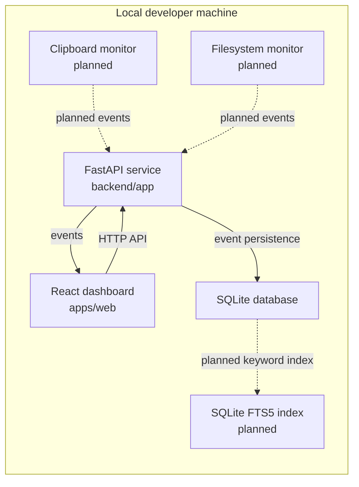

# GhostMirror

GhostMirror is a local-first developer intelligence dashboard for capturing developer activity as structured events and making local workflow history easier to inspect.

The current application provides a React dashboard shell and a FastAPI backend with persisted event storage. Clipboard monitoring, filesystem ingestion, full-text search, richer activity views, semantic retrieval, and desktop packaging are planned.

## Capabilities

Available now:

- React + TypeScript dashboard shell in `apps/web`.
- FastAPI service in `backend`.
- `GET /health` endpoint for runtime checks.
- SQLite-backed event persistence.
- Event API for create, list, read, and delete operations.
- SQLAlchemy model and Alembic migration for the `events` table.
- Docker Compose configuration for local development.

Planned:

- Clipboard event ingestion.
- Filesystem event ingestion.
- Keyword search with SQLite FTS5.
- Source and event-type filtering.
- Activity timeline and event detail views backed by persisted events.
- Semantic retrieval after keyword search is stable.
- Backend tests, frontend tests, and CI validation.
- Desktop distribution with Tauri.

## Architecture



Backend package layout:

```text
backend/app
|-- api
|-- core
|-- db
|-- models
|-- schemas
`-- services
```

The backend separates routing, configuration, database access, persistence models, validation schemas, and service logic.

## Tech Stack

Frontend:

- React
- TypeScript
- Vite
- Tailwind CSS
- Zustand
- TanStack Query

Backend:

- FastAPI
- Python 3.11+
- Pydantic
- SQLite
- SQLAlchemy
- Alembic

Planned testing and operations:

- pytest
- Vitest
- Playwright
- GitHub Actions

Planned desktop distribution:

- Tauri

## Repository Layout

```text
ghostmirror/
|-- apps/
|   `-- web/              # React + TypeScript dashboard
|-- backend/              # FastAPI application
|   |-- alembic/          # database migrations
|   `-- app/
|       |-- api/          # HTTP routes
|       |-- core/         # application settings and shared config
|       |-- db/           # database setup and sessions
|       |-- models/       # persistence models
|       |-- schemas/      # request and response schemas
|       `-- services/     # business logic
|-- docs/                 # architecture notes and technical decisions
|-- tests/                # test suites
|-- .github/
|   `-- workflows/        # CI workflows
|-- docker-compose.yml
`-- README.md
```

## Local Development

Prerequisites:

- Git
- Node.js LTS
- npm
- Python 3.11+
- Docker optional

Frontend:

```bash
cd apps/web
npm install
npm run dev
```

Useful frontend checks:

```bash
cd apps/web
npm run lint
npm run build
```

Backend:

```bash
python3 -m venv .venv
source .venv/bin/activate
pip install -r backend/requirements.txt
cd backend
alembic upgrade head
uvicorn app.main:app --reload
```

Health check:

```bash
curl http://127.0.0.1:8000/health
```

Create an event:

```bash
curl -X POST http://127.0.0.1:8000/events \
  -H "Content-Type: application/json" \
  -d '{"source":"clipboard","event_type":"snippet","title":"Copied SQL query","content":"select * from events;","metadata":{"language":"sql"}}'
```

List events:

```bash
curl http://127.0.0.1:8000/events
```

Docker Compose:

```bash
docker compose up
```

## Roadmap

- [x] Application foundation
- [x] Local event persistence
- [ ] Filesystem and clipboard ingestion
- [ ] Full-text search
- [ ] Activity timeline
- [ ] Semantic retrieval
- [ ] Desktop distribution
