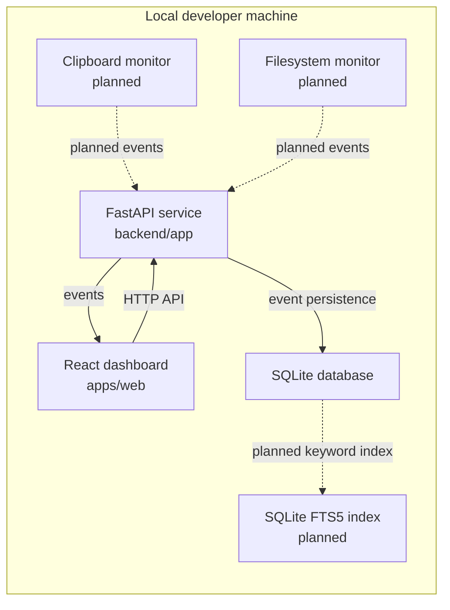

# GhostMirror

GhostMirror is a local-first developer activity dashboard for storing structured events and making local workflow history easier to inspect.

The current application includes a React dashboard connected to a FastAPI backend, SQLite event persistence, and backend tests for the event API. Clipboard monitoring, filesystem ingestion, full-text search, richer timeline views, semantic retrieval, and desktop distribution are planned.

## Capabilities

Available now:

- React + TypeScript dashboard in `apps/web`.
- FastAPI service in `backend`.
- `GET /health` endpoint for runtime checks.
- SQLite-backed event persistence.
- Event API for create, list, read, and delete operations.
- Dashboard UI for listing, creating, refreshing, and deleting events.
- SQLAlchemy model and Alembic migration for the `events` table.
- Backend tests for health and event API behavior.
- Docker Compose configuration for local development.

Planned:

- Clipboard event ingestion.
- Filesystem event ingestion.
- Keyword search with SQLite FTS5.
- Source and event-type filtering.
- Activity timeline and event detail views backed by persisted events.
- Semantic retrieval after keyword search is stable.
- Frontend tests and CI validation.
- Desktop distribution with Tauri.

## Tech Stack

| Layer | Tech |
|-------|------|
| Frontend | React, TypeScript, Vite, Tailwind CSS |
| Backend | Python, FastAPI, Pydantic |
| Database | SQLite, SQLAlchemy, Alembic |
| Testing | pytest |

## Architecture



## Running Locally

Requirements:

- Node.js LTS
- npm
- Python 3.11+

Frontend:

```bash
cd apps/web
npm install
npm run dev
```

The frontend calls `http://127.0.0.1:8000` by default. Set `VITE_API_BASE_URL` to use a different API URL.

Frontend checks:

```bash
cd apps/web
npm run lint
npm run build
```

Backend:

```bash
python3 -m venv .venv
source .venv/bin/activate
pip install -r backend/requirements-dev.txt
cd backend
alembic upgrade head
uvicorn app.main:app --reload
```

Backend tests:

```bash
pytest
```

Health check:

```bash
curl http://127.0.0.1:8000/health
```

Create an event:

```bash
curl -X POST http://127.0.0.1:8000/events \
  -H "Content-Type: application/json" \
  -d '{"source":"clipboard","event_type":"snippet","title":"Copied SQL query","content":"select * from events;","metadata":{"language":"sql"}}'
```

List events:

```bash
curl http://127.0.0.1:8000/events
```

## Project Structure

```text
apps/web/     - React dashboard
backend/      - FastAPI and SQLite event API
docs/         - architecture notes and technical decisions
tests/        - backend test suite
```

## Roadmap

- [x] Application foundation
- [x] Local event persistence
- [x] Backend event API tests
- [ ] Filesystem and clipboard ingestion
- [ ] Full-text search
- [ ] Activity timeline
- [ ] Semantic retrieval
- [ ] Desktop distribution
