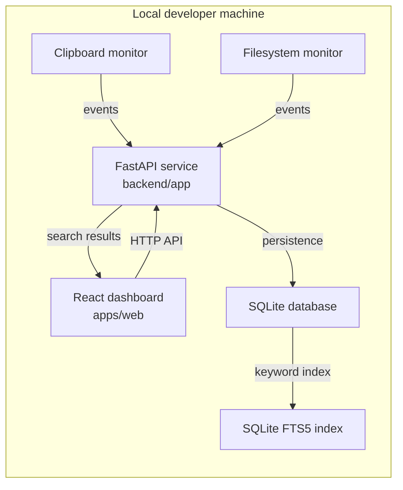

# GhostMirror

GhostMirror is a local-first developer intelligence dashboard for capturing developer activity, storing it as searchable events, and making local workflow history easier to inspect.

The application is designed around explicit event capture, local storage, keyword search, and activity views that help developers understand recent work without sending private workspace data to a remote service.

## Capabilities

Available now:

- React + TypeScript dashboard in `apps/web`.
- FastAPI service in `backend`.
- `GET /health` endpoint for runtime checks.
- Docker Compose configuration for local development.
- Base package layout for API routes, schemas, services, models, and database code.

Planned:

- SQLite-backed event persistence.
- SQLAlchemy models and Alembic migrations.
- Clipboard and filesystem event ingestion.
- Keyword search with SQLite FTS5.
- Source and event-type filtering.
- Activity timeline and event detail views.
- Backend tests and CI validation.
- Desktop packaging after the web and API layers are stable.

## Architecture



Backend package layout:

```text
backend/app
|-- api
|-- core
|-- db
|-- models
|-- schemas
`-- services
```

The backend separates routing, configuration, database access, persistence models, validation schemas, and service logic so each layer can evolve independently.

## Tech Stack

Frontend:

- React
- TypeScript
- Vite
- Tailwind CSS
- Zustand
- TanStack Query

Backend:

- FastAPI
- Python 3.11+
- Pydantic
- SQLite
- SQLAlchemy
- Alembic

Search:

- SQLite FTS5 for keyword search
- Additional retrieval strategies may be evaluated after event storage and keyword search are stable

Testing and operations:

- pytest
- Vitest
- Playwright
- Docker Compose
- GitHub Actions

Desktop:

- Tauri is planned for local desktop distribution.

## Repository Layout

```text
ghostmirror/
|-- apps/
|   `-- web/              # React + TypeScript dashboard
|-- backend/              # FastAPI application
|   `-- app/
|       |-- api/          # HTTP routes
|       |-- core/         # application settings and shared config
|       |-- db/           # database setup and sessions
|       |-- models/       # persistence models
|       |-- schemas/      # request and response schemas
|       `-- services/     # business logic
|-- docs/                 # architecture notes and technical decisions
|-- tests/                # test suites
|-- .github/
|   `-- workflows/        # CI workflows
|-- docker-compose.yml
`-- README.md
```

## Local Setup

Prerequisites:

- Git
- Node.js LTS
- npm
- Python 3.11+
- Docker optional

Install frontend dependencies:

```bash
cd apps/web
npm install
```

Run the frontend:

```bash
cd apps/web
npm run dev
```

Build the frontend:

```bash
cd apps/web
npm run build
```

Set up the backend:

```bash
python3 -m venv .venv
source .venv/bin/activate
pip install -r backend/requirements.txt
```

Run database migrations:

```bash
cd backend
alembic upgrade head
```

Run the backend:

```bash
cd backend
uvicorn app.main:app --reload
```

Check the API:

```bash
curl http://127.0.0.1:8000/health
```

Expected response:

```json
{"status":"ok","service":"ghostmirror-api"}
```

## Development Commands

Frontend:

```bash
cd apps/web
npm run dev
npm run build
npm run lint
```

Backend:

```bash
source .venv/bin/activate
cd backend
uvicorn app.main:app --reload
```

Docker Compose:

```bash
docker compose up
```

## Limitations

- Event persistence is not implemented yet.
- Clipboard and filesystem monitoring are not implemented yet.
- Search endpoints are not implemented yet.
- Tests and CI workflows are not configured yet.
- Docker Compose is currently a development convenience, not a production deployment target.

## Roadmap

Environment and repository setup:

- Verify local development prerequisites.
- Connect the local repository to GitHub.

Application foundation:

- Create the repository structure.
- Add the React dashboard application.
- Add Tailwind CSS styling.
- Add the FastAPI application.
- Add the `/health` endpoint.

Event system:

- Add SQLAlchemy and SQLite.
- Create the event model.
- Add Pydantic schemas for event requests and responses.
- Add event create, list, read, and delete endpoints.
- Add timestamps and input validation.

Dashboard:

- Add event cards.
- Add activity timeline views.
- Add analytics cards based on persisted events.
- Add responsive empty, loading, and error states.

API integration:

- Connect the dashboard to the event API.
- Add create and delete flows.
- Add request loading and error handling.

Search:

- Add SQLite FTS5 keyword search.
- Add fallback search for environments without FTS5 support.
- Add source and event-type filters.

Testing:

- Add backend tests for health checks.
- Add backend tests for event lifecycle endpoints.
- Add frontend tests after the dashboard has API-backed flows.

Operations:

- Add frontend lint and build checks.
- Add backend test checks.
- Add GitHub Actions workflows.

Documentation:

- Add `docs/architecture.md`.
- Add `docs/api.md`.
- Add `docs/roadmap.md`.
- Add `docs/decisions.md`.

## Engineering Principles

- Keep data local by default.
- Prefer explicit event schemas over unstructured logs.
- Build keyword search before adding more complex retrieval.
- Keep API boundaries small and testable.
- Store enough metadata for filtering without over-collecting private data.
- Add tests around persistence, validation, and API contracts.
- Keep documentation tied to implemented behavior and known limitations.
